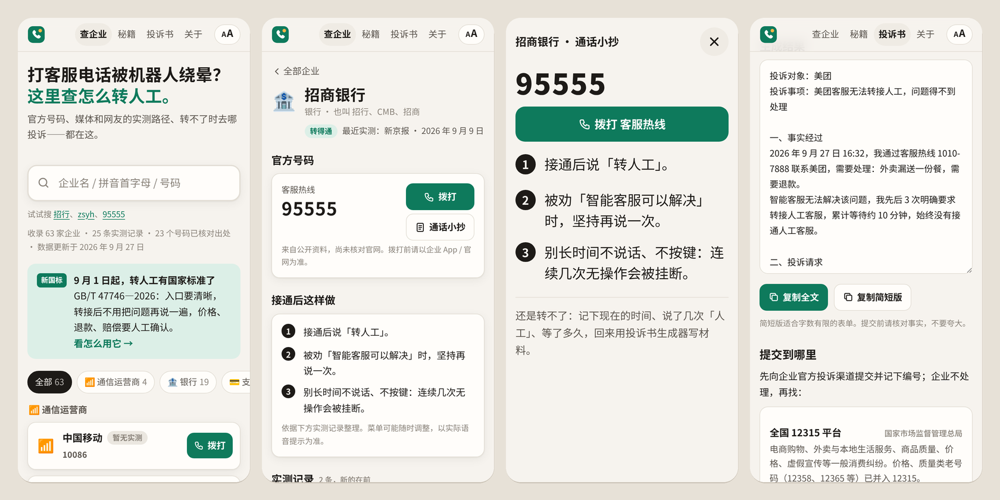

<div align="center">


# 转人工速查

**打客服电话被机器人绕晕？这里查怎么转人工。**

各大企业客服的官方号码 · 媒体和网友的实测转人工路径 · 转不了时去哪投诉 · 一键生成投诉书

[**打开网站 →**](https://fuzzylogic112.github.io/zhuanrengong/) &nbsp;·&nbsp; [提交实测反馈](https://github.com/FuzzyLogic112/zhuanrengong/issues/new?template=report.yml) &nbsp;·&nbsp; [纠错 / 假冒号码](https://github.com/FuzzyLogic112/zhuanrengong/issues/new?template=wrong-info.yml)

[](https://github.com/FuzzyLogic112/zhuanrengong/actions/workflows/ci.yml)
[](LICENSE)
[](LICENSE-DATA)



</div>

## 为什么做这个

- 中国消费者协会发布的 **2026 年上半年投诉热点** 中，AI 客服是其中之一：服务承诺和人工接入问题突出。（[中新网](https://www.chinanews.com.cn/cj/2026/08-05/10672180.shtml)）
- 新黄河 2026 年 8 月实测 20 家平台：转人工 **平均 171 秒，最长 660 秒，6 家始终没接通**。（[腾讯新闻](https://news.qq.com/rain/a/20260804A0DBEQ00)）
- 2026 年 9 月 1 日，首个 AI 客服协同国标 **GB/T 47746—2026《顾客联络服务 人工与智能客户服务协同要求》** 实施：转人工入口要清晰，转接后不能让你重复陈述，价格、退款、赔偿要人工确认。（[搜狐](https://www.sohu.com/a/1065411209_114838) · [新华网](https://www.news.cn/20260902/328e49d1d06649a0acdf27f90ce13232/c.html)）

标准有了，但每家企业的菜单都不一样，还经常变。与其每个人都在语音菜单里绕一遍，不如把试出来的路径记下来，共享给下一个人。

## 能做什么

| | |
| --- | --- |
| 🔍 **秒搜企业** | 中文名、简称、拼音、首字母、电话号码都能搜：`招行`、`zsyh`、`95555` 都能找到招商银行 |
| 📞 **官方号码** | 一键拨打。每个号码标明出处，核对过的附核对日期和链接 |
| 🧭 **接通后这样做** | 依据媒体和网友实测整理的转人工步骤；没有实测的企业只给行业通用方法，并明确标注 |
| 🗒️ **通话小抄** | 大字全屏显示号码和步骤，打电话时放在手边看，自动保持屏幕常亮，适合长辈 |
| 📋 **实测记录** | 每条都有日期、渠道、结果和出处链接，超过一年的会提示可能已过期 |
| ⚖️ **转不了人工？** | 按行业给出投诉渠道：12378、12363、工信部申诉、12305、12326、12328、12315、12345…… |
| ✍️ **投诉书生成器** | 填几项，自动写好事实经过、诉求、法律依据和证据清单，一键复制。**只在浏览器本地生成，不上传** |
| 🛡️ **防骗提醒** | 官方客服不会让你转账、开屏幕共享、报验证码；搜索引擎里的「客服电话」可能是假冒的 |
| 🔠 **大字模式 · 离线可用** | 右上角一键大字；装到手机桌面后没网也能查 |

## 数据现状

目前收录 **63 家企业**（通信运营商、银行、支付、电商、外卖、出行、铁路、航空、快递、保险、电网），**25 条实测记录**，其中 **23 个号码已在官方出处核对**。

我们对数据的可信度很较真：

- **号码**：来自企业官网或公开资料。标「已核对出处」的，是维护者在出处页面核对过的；没标的来自公开资料、尚未逐一核对，页面上会写明「拨打前请以企业 App / 官网为准」。查不到可靠官方号码的企业（如拼多多），宁可留空也不填。
- **转人工步骤**：必须能在实测记录里找到依据，校验脚本会强制检查。首批实测来自 [新京报 2026 年 9 月实测近 30 家平台](https://news.qq.com/rain/a/20260909A04K8J00) 和 [凤凰WEEKLY财经 2026 年 3 月实测 10 家银行](https://finance.sina.com.cn/wm/2026-03-07/doc-inhqcipv5499286.shtml)。
- **还缺很多**：大多数企业还没有实测记录。**你打完一次客服电话，花一分钟反馈结果，就是最大的贡献。**

## 参与贡献

- 📞 **打过电话？** 在企业页点「我刚打过，反馈结果」，或直接 [提交实测反馈](https://github.com/FuzzyLogic112/zhuanrengong/issues/new?template=report.yml)。
- ⚠️ **号码错了 / 发现假冒号码？** [提交纠错](https://github.com/FuzzyLogic112/zhuanrengong/issues/new?template=wrong-info.yml)，优先处理。
- ➕ **想收录新企业？** [提交新增申请](https://github.com/FuzzyLogic112/zhuanrengong/issues/new?template=new-company.yml)，或直接加一个 YAML 文件发 PR。

每家企业就是 `data/companies/` 下一个人能读懂的 YAML 文件。格式和规则见 [CONTRIBUTING.md](CONTRIBUTING.md)。

## 本地开发

```bash
npm install
npm run validate   # 校验数据
npm test           # 单元测试
npm run dev        # 构建并在 http://localhost:4173 预览
```

零前端框架、零运行时依赖、不引用任何外部 CDN 和字体（国内访问稳定）。`scripts/build.mjs` 校验数据、生成拼音索引，输出静态站点到 `dist/`；推送到 `main` 后由 GitHub Actions 测试并部署到 GitHub Pages。

```
data/
  companies/*.yaml   每家企业一个文件：号码、步骤、实测记录
  categories.yaml    行业分类与通用方法
  regulators.yaml    投诉 / 监管渠道
site/                网站源码（原生 HTML / CSS / JS）
  lib/search.js      搜索（中文、拼音、首字母、号码）
  lib/complaint.js   投诉书生成
scripts/             数据校验、构建、本地预览
tests/               单元测试
```

## 免责声明

本项目信息仅供参考。客服号码与菜单可能随时调整，**拨打前请以企业 App / 官网公布为准**。本项目与所列企业、监管部门均无关联，不提供任何客服服务，也不会主动联系你。投诉书生成器只帮你整理文字，不构成法律意见。

## 许可

- 代码：[MIT](LICENSE)
- 数据（`data/` 目录）：[CC BY-SA 4.0](LICENSE-DATA)。实测记录中引用的媒体报道版权归原媒体所有，本项目仅以摘要形式引用并附原文链接。
